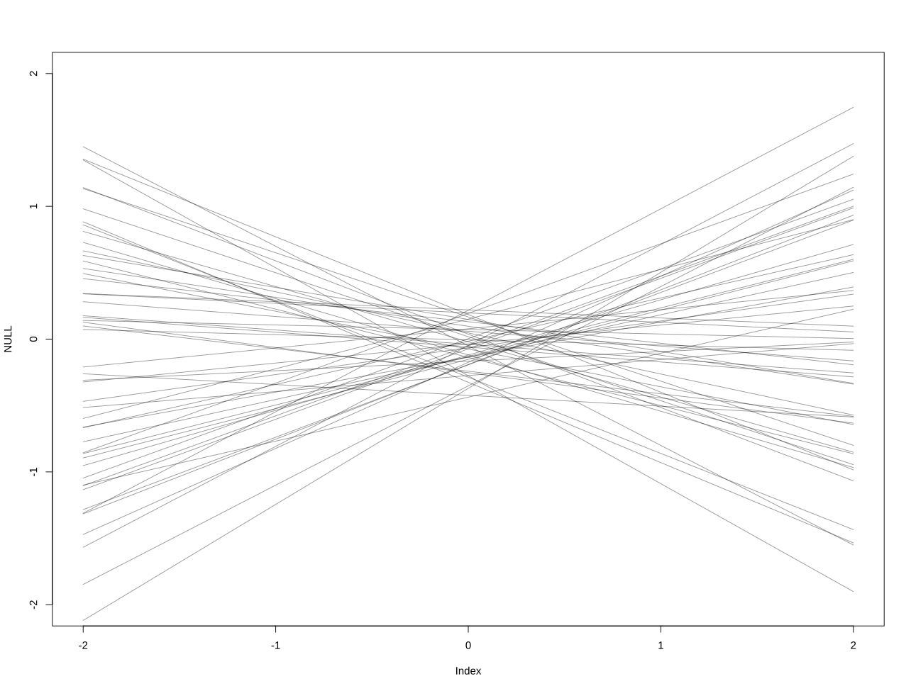

A big part of Bayesian modeling (no matter if we are talking about MAP or just "normal" Bayesian models) is choosing the priors. The priors are our assumptions for the process of certain parameters within the model. Sometimes the prior is given, for example, when we have domain knowledge, but sometimes we need to choose it ourselves. 
1) The first thing we need to keep in mind, is to choose a suitable distribution for the prior. If it’s unknown, we typically use something called a **conjugate prior**. A conjugate prior is a type of prior distribution, that when combined with a specific likelihood function, results in a posterior distribution that belongs to the same family as the prior. We can look up conjugated priors on the internet. 
2) We also need to choose the parameters for the priors. These are hyperparameters. But, given enough data, the Bayesian model returns the same estimate even for different priors. But is it still very important to check and investigate our priors!
## Investigating Priors
We always want to check our priors using *prior predictive checks*. Conceptually, we’re **“testing out” the model structure with prior draws** across plausible predictor values, to ensure the implied outcomes make sense. The plausible predictor values are just *test inputs* we generate. For example like this: list(A = c(-2, 2)). They define the range of predictor values over which you want to visualize the model’s implied behavior before seeing real data.

Let's say we define our model and our priors like this: 
- $D_i∼Normal(μ_i,σ)$ with $μ_i=a+b_A*A_i$
- $a∼Normal(0,0.2)$
- $b_A∼Normal(0,0.5)$
- $σ∼Exponential(1)$

Now lets do a prior predictive check. We draw 50 prior samples of $(a,b_A,σ)$ (no data influence yet). For each prior draw, we compute $μ$ at $A=−2$ and $A=2$ (we standardize the data in this case so this range is good enough). Because a straight line is fully determined by two points, connecting the two computed values for $μ$ at $A = -2$ and $A=2$ over the sampled values visualizes the prior over functions (prior predictive for the mean, not the outcomes). Here is an example:

``` r
data(WaffleDivorce)
d <- WaffleDivorce

# standardize variables
d$A <- scale( d$MedianAgeMarriage )
d$D <- scale( d$Divorce )

m5.1 <- quap(
	alist(
		D ~ dnorm( mu , sigma ) ,
			mu <- a + bA * A ,
			a ~ dnorm( 0 , 0.2 ) ,
			bA ~ dnorm( 0 , 0.5 ) ,
			sigma ~ dexp( 1 )
	) , data = d )

set.seed(10)
prior <- extract.prior( m5.1 )
mu <- link( m5.1 , post=prior , data=list( A=c(-2,2) ) )
plot( NULL , xlim=c(-2,2) , ylim=c(-2,2) )
for ( i in 1:50 ) lines( c(-2,2) , mu[i,] , col=col.alpha("black",0.4) )
```

Here is the corresponding plot:


Her we can see that we don't have crazy outliers but also a nice distribution of possible outcomes. This is exactly what we want!

More examples can be found in this Bayesian causal inference script: [Bayesian_causal_inference](../Projects/Bayesian%20Statistics/Bayesian_causal_inference.rs).
