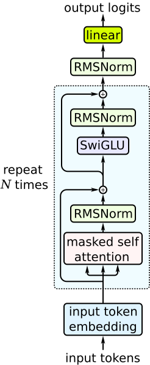

## MLPs
A Multilayer Perceptron (MLP), also known as a Feedforward Neural Network (FNN), is the simplest form of a deep learning model. It consists of layers of neurons where each neuron in one layer is connected to every neuron in the next layer — hence the term _fully connected_.

An MLP is composed of:
- Input layer – receives the raw input features (e.g., pixel values, measurements).
- Hidden layers – perform transformations on the input using learned weights and nonlinear activation functions.
- Output layer – produces the final prediction (e.g., class probabilities).

MLPs work well for tabular or low-dimensional data, but they do not scale efficiently to structured data like images or sequences. They ignore spatial or temporal relationships because every input is treated as independent — motivating architectures like CNNs and RNNs.
## Convolutional Neural Networks
CNNs are designed for grid-like data (e.g., images) to detect local patterns (edges, textures, shapes). Instead of flattening an image, CNNs preserve its spatial structure by using filters (kernels) that scan through small patches of the image. For an example of how to do image classification using CNNs, look here [Image Classification with CNN](../Projects/Image%20Classification%20with%20CNN/Image%20Classification%20with%20CNN.py). 

Here is how these kernels work. A kernel is basically a small window that is applied on different parts of an image. A kernel could for example look like this: 

```
[[-1, 0, 1],
 [-1, 0, 1],
 [-1, 0, 1]]
```

These weights (-1,0,1) within this kernel are a representation of a pattern and are learned in the training process. In a convolutional layer we now apply multiple of these kernels to detect multiple local patterns. 

By taking the output of one convolutional layer as input to the next convolutional layer, we can increase the receptive field of the model even thought the size of the kernels stays the same (usually 3x3). By increasing the receptive field the complexity of the patterns we can detect also grows (e.g. from *edge* to *eye*).

This whole process is just the feature extraction. We can think of it like this: The convolutional layers extract that the image contains two eyes, a nose, hair, ... and so on. These features are the input for the fully connected layer which then classifies the image based on these features.
### Subsampling in CNNs
 The core idea behind all subsampling methods is to reduce the spatial size of the feature maps (i.e., the height and width). One popular one is pooling.

The pooling layer serves to downsample the feature maps produced by the convolutional layers. It reduces the spatial size (height × width) of the input feature map, keeping only the most important information. This increases translation invariance — slight translations or distortions in the image don’t affect the output significantly.
- Common types of pooling:
	- Max pooling: Keeps the maximum value in each region.
	- Average pooling: Takes the average of the values in the region.
### Architecture of CNNs
The basic architecture of CNNs follows this principle:
- Convolutional layer, for feature extraction as described above.
- Subsampling, to reduce the spatial size of the feature maps.
  => These two follow each other for how many layers we want.
- Fully connected layer, for the final classification task (like an FNN layer).
## Recurrent Neural Networks
A recurrent neural network (RNN) is any network that contains a cycle within its network connections, meaning that the value of some unit is directly, or indirectly, dependent on its own earlier outputs as an input.

We can think of RNNs as FNNs reused across time steps, with shared weights. That reuse is what gives RNNs the ability to learn temporal dependencies. Therefore they are especially relevant in time series analysis.
### Basic Architecture
An RNN augments a regular feedforward layer with a _recurrent connection_ from the previous hidden state. At time step t the basic equations are:
- $h_t = g(U h_{t-1} + W x_t)$
- $y_t = f(V h_t)$
where:
- $x_t$ — input vector at time t (usually an embedding).
- $h_t\in\mathbb{R}^{d_h}$ — hidden state (the “memory” at time t).
- $y_t$ — output (e.g. logits or softmax probabilities).
- $W\in\mathbb{R}^{d_h\times d_{in}}, U\in\mathbb{R}^{d_h\times d_h}, V\in\mathbb{R}^{d_{out}\times d_h}$ are weight matrices **shared across time**.
- $g(\cdot)$ is a nonlinearity (tanh, ReLU, …); $f(\cdot)$ often includes softmax for classification.

Why this matters: the hidden state $h_t$ is a learned vector summary of everything the model has “seen” so far — in principle it can carry information from arbitrarily far back in the sequence (unlike n-gram or fixed-window models). The recurrence is exactly the mechanism that lets the network propagate information forward across time.

In the training of RNNs we use something called *backpropagation through time (BPTT)*. This is conceptually very similar to "normal" backpropagation, but instead of going down and up the layers, we go down and up the time steps. We compute forward through all time steps, accumulate losses (e.g. cross-entropy at each step or only at final step for sequence classification) aka *forward pass*, then backpropagate errors backwards through time to get gradients for the shared matrices W, U, V aka *backward pass*.

TBD:
- vanishing gradients
- exploding gradients
- rnns as language models
- RNNs for other NLP tasks
- Stacked and bidirectional RNNs
### LSTM
TBD
### GRU
TBD
## Transformers
The Transformer architecture was introduced in *Vaswani et al., 2017 – “Attention Is All You Need.”* The key motivation was to remove [recurrence](Deep%20Learning%20Paradigms%20and%20Building%20Blocks.md#recurrence) and [convolution](Deep%20Learning%20Paradigms%20and%20Building%20Blocks.md#convolutional-processing) from sequence models and rely entirely on [attention](Deep%20Learning%20Paradigms%20and%20Building%20Blocks.md#attention-mechanisms) for sequence mixing and long-range dependencies.

A **Transformer** is defined by a specific architectural template consisting of:
- Two major blocks: Self-attention and MLP. The self-attention layer models the relational structure of the data, we can say it determines "which variables matter". The MLP layer introduces the non-linear transformation and answer the question: "Given those variables, what transformation should I apply?". 
	- For more on the multi-head self-attention layer, look here: [Deep Learning Paradigms and Building Blocks](Deep%20Learning%20Paradigms%20and%20Building%20Blocks.md).
	- The MLP layer is usually just a linear layer + a non-linear activation function (e.g. SwiGLU)  + another linear layer. So we want, for each token independently (no interaction here), to expand the latent space, introduce non-linearity, compress back down. 
- Residual connections + layer normalization as essential components.
- No Recurrence, No Convolution (which enables full parallelization during training).
- Positional Encodings; additionally added to the "normal" embeddings to inject word order.

Modern variants (GPT, BERT, T5, LLaMA, ViT) might have slight deviations from this architecture, but are still called “Transformers” as long as they preserve its main features.

Here is an example implementation of the transformer architecture:

